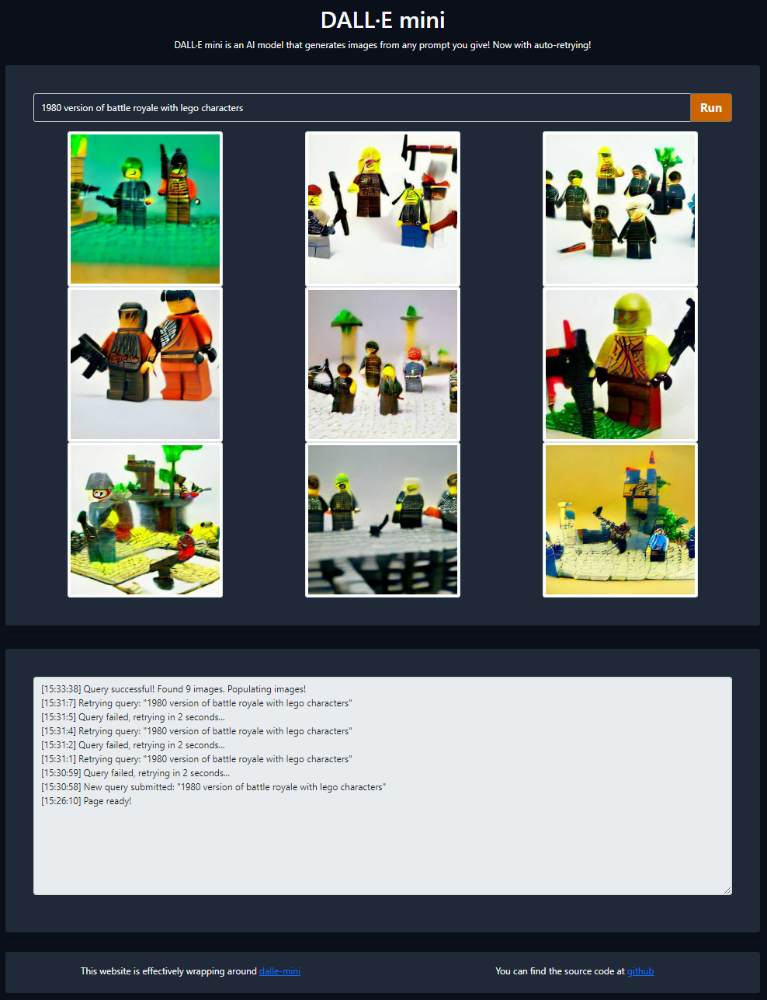
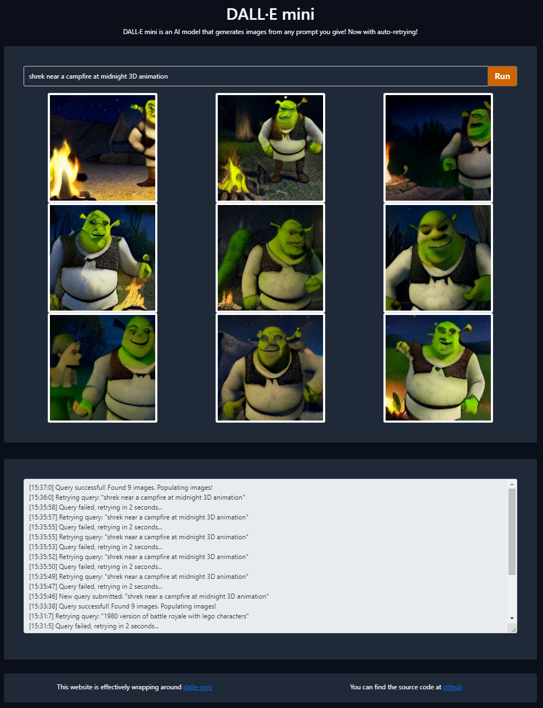

# dalle-mini-retry-website

### Overview
This is a website that hits the same endpoint as https://huggingface.co/spaces/dalle-mini/dalle-mini, and will auto retry until it succeeds (sleeping 2 seconds in between attempts). 
Upon running, the website will attempt to the api.php script, which itself attempts to hit the dalle-mini endpoint. If successful, it will
eventually return 9 images, which will populate the 9 empty image boxes. Logs can be found in the text area below the image boxes.

### Images

### Technical Overview
dalle-mini will return a 5xx error if it is overloaded wtih traffic. If your request gets through, a connection will be left open for the
duration of the job. The job ranges anywhere from 50 to like 90 seconds. Keep this in mind if hosting this tool locally. When the job is
finished, 9 images are returned in the form of a base64 encoded string. The api.php will handle the response and prepare it for being returned
to the javascript code.

### Why is api.php required?
You might be wondering why javascript can't just request from dalle-mini directly. This has mainly to do with CORS restrictions, and the 
inability of javascript to performa POST request to another domain. As such, we use our own php script to perform the POST request, and 
then maintain a connection to our own server.

### Deployment
If you wish to deploy this code, simply move the files into an accessible, php enabled directory on your website. Make sure to make the following
changes:
- change `API_ENDPOINT` in `script.js` to point to your php api script.

### License 
- MIT

### Credit
- dalle-mini: https://huggingface.co/spaces/dalle-mini/dalle-mini
